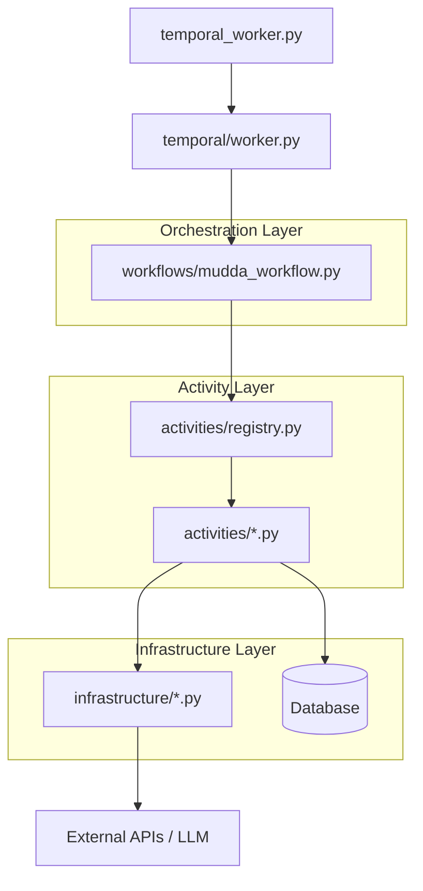

# Mudda AI Workflow: Temporal Architecture & Flow

This document explains how the various parts in the `backend` directory work together to orchestrate civic issue resolution using Temporal.

## Architecture Overview

The system follows a production-grade, layered architecture that separates orchestration, business logic, and external integrations.

---

## Component Breakdown

### 1. `backend/temporal_worker.py` (The Entry Point)

This is the main script that starts the Temporal worker process.

- **Role**: Bootstraps the application.
- **Action**: Initializes `TemporalWorkerManager` and calls `worker_manager.start()`.

### 2. `backend/temporal/` (The Registry)

Contains the logic for connecting to the Temporal server and registering workflows/activities.

- **`worker.py`**: Defines `TemporalWorkerManager`. This is where `MuddaWorkflow` and all individual activity functions are registered with the Temporal server.

### 3. `backend/workflows/` (The Orchestrator)

This is the "brain" of the operation.

- **`mudda_workflow.py`**: Defines `MuddaWorkflow`.
- **Role**: Manages the sequence of steps, handles human approval (via **Signals**), and maintains the execution state (`execution_results`, `ai_context`).
- **Flow**:
  1. Updates the execution status in the DB via activity.
  2. Iterates through the activity-based `workflow_plan` steps.
  3. Resolves template variables for inputs.
  4. Calls the relevant activity directly using the registry.

### 4. `backend/activities/` (The Workers)

Activities are where the actual "work" (IO/Side-effects) happens.

- **`registry.py`**: Centralized metadata and registration hub. Maps activity IDs to their actual Python functions.
- **Specific Activities**: (e.g., `issue_activities.py`, `notification_activities.py`)
  - These handle specific tasks like updating the database, sending emails, or contacting external contractors.
  - They are designed to be idempotent and safe for retries via Temporal.

### 5. `backend/infrastructure/` (The Adapters)

This layer encapsulates external system logic.

- **Role**: Provides clean wrappers for APIs (Gemini LLM, Email, Contractor APIs).
- **Separation of Concerns**: Activities use these adapters so they don't have to deal with the low-level details of HTTP requests or vendor-specific SDKs.

---

## Step-by-Step Execution Flow

1.  **Workflow Start**: An external client (like a FastAPI router) starts `MuddaWorkflow` with a `workflow_plan`.
2.  **Tracking**: The workflow immediately calls `update_execution_status` activity to record that it has started in the database.
3.  **Step Execution**:
    - For each step in the plan, the workflow resolves inputs and calls the specific activity directly.
    - **Step Approval**: If a step needs approval, the workflow waits for a Signal before proceeding.
4.  **Completion**: Once all steps are finished, the workflow calls `update_execution_status` one last time to mark the entire execution as "completed" and stores the final results.
