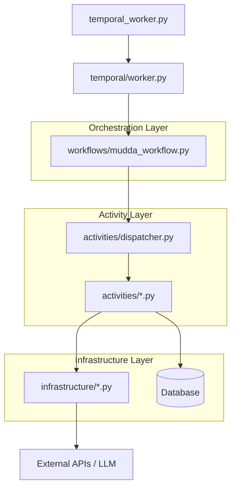

# Mudda AI Workflow: Temporal Architecture & Flow

This document explains how the various components in the `backend` directory work together to orchestrate civic issue resolution using Temporal.

## Architecture Overview

The system follows a production-grade, layered architecture that separates orchestration, business logic, and external integrations.

---

## Component Breakdown

### 1. `backend/temporal_worker.py` (The Entry Point)
This is the main script that starts the Temporal worker process.
- **Role**: Bootstraps the application.
- **Action**: Initializes `TemporalWorkerManager` and calls `worker_manager.start()`.

### 2. `backend/temporal/` (The Registry)
Contains the logic for connecting to the Temporal server and registering components.
- **`worker.py`**: Defines `TemporalWorkerManager`. This is where `MuddaWorkflow` and all individual activity functions are registered with the Temporal server.
- **`client.py`**: (Implicitly used) Provides a clean interface for starting workflows from the FastAPI routers or other external services.

### 3. `backend/workflows/` (The Orchestrator)
This is the "brain" of the operation.
- **`mudda_workflow.py`**: Defines `MuddaWorkflow`.
- **Role**: Manages the sequence of steps, handles human approval (via **Signals**), and maintains the execution state (`execution_results`, `ai_context`).
- **Flow**:
    1. Updates the execution status in the DB to "running".
    2. Iterates through the `workflow_plan` steps.
    3. If a step `requires_approval`, it pauses and waits for an `approve_step` signal.
    4. Calls the `dispatch_component_step` activity for each step.
    5. Aggregates results and updates the DB status on completion or failure.

### 4. `backend/activities/` (The Workers)
Activities are where the actual "work" (IO/Side-effects) happens.
- **`dispatcher.py`**: The central hub. Instead of the workflow knowing about every activity, it calls the dispatcher. The dispatcher looks up the component in the DB, determines its category, and routes it to the correct activity handler.
- **Specific Activities**: (e.g., `issue_activities.py`, `notification_activities.py`)
    - These handle specific tasks like updating the database, sending emails, or contacting external contractors.
    - They are designed to be idempotent and safe for retries.

### 5. `backend/infrastructure/` (The Adapters)
This layer encapsulates external system logic.
- **Role**: Provides clean wrappers for APIs (Gemini LLM, Email, Contractor APIs).
- **Separation of Concerns**: Activities use these adapters so they don't have to deal with the low-level details of HTTP requests or vendor-specific SDKs. This makes the system easier to test and maintain.

---

## Step-by-Step Execution Flow

1.  **Workflow Start**: An external client (like a FastAPI router) starts `MuddaWorkflow` with a `workflow_plan`.
2.  **Tracking**: The workflow immediately calls `update_execution_status` activity to record that it has started in the database.
3.  **Step Execution**:
    - For each step in the plan, the workflow calls `dispatch_component_step`.
    - **Step Approval**: If a step needs approval, the workflow waits. A human (via the UI) sends a signal to the workflow, which then proceeds.
4.  **Dispatching**:
    - The `dispatcher` activity fetches the `Component` metadata from the DB.
    - It routes the request to a specific activity (e.g., `generate_report`).
5.  **External Action**:
    - The specific activity (`generate_report`) uses an infrastructure service (`LLMService`) to perform the task.
6.  **Completion**: Once all steps are finished, the workflow calls `update_execution_status` one last time to mark the entire execution as "completed" and stores the final results.
